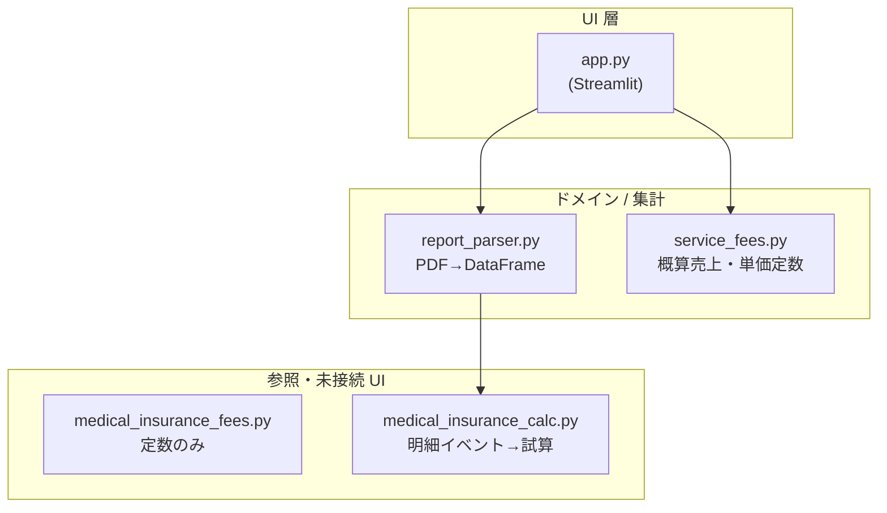

# アーキテクチャ — 訪問件数仕分けアプリ Ver.1

このドキュメントは **同じ構成で再実装・保守** するための地図です。実装の詳細は各モジュールの先頭 docstring に寄せています。

---

## 1. レイヤ構成（依存の向き）

| モジュール | 役割 |
|------------|------|
| **app.py** | セッション状態、ファイル I/O、フィルタ、ダッシュボード描画、CSV 列の表示制御。ビジネスルールの「本体」は持たない。 |
| **report_parser.py** | PDF 全文抽出、担当ブロック分割、サマリー件数、支援/介護分割、分数・職種、内部列（`_vis3` 等）。 |
| **service_fees.py** | 介護保険 10 割相当の単価定数、`estimate_row_revenue_yen`、`add_revenue_columns`（医療暫定を概算に加算）。 |
| **medical_insurance_calc.py** | PDF から医療「明細行」イベントを拾い、週・月初等の試算に使う（**Ver.1 では UI から bundle 表示を削除済み**。ライブラリとして残存）。 |
| **medical_insurance_fees.py** | 医療保険の利用料定数（参照用）。 |

**原則:** UI にロジックを増やさず、数値・区分の定義は `service_fees`、抽出・集約は `report_parser`。

---

## 2. データの流れ（担当別 PDF モード）

1. **アップロード** → `app` が先頭 PDF のバイト列を `summarize_monthly_visit_hours_from_report_pdf`（`app` 内）→ 実体は `report_parser.summarize_report_pdf`。
2. **report_parser** が `report_df` 相当の `DataFrame` を生成（内部列 `_職種`, `_分数合計`, `_vis3`, `_p60`, `_vis*_s/c` 等）。
3. **app** が表示用フィルタ → `add_revenue_columns` → `add_medical_insurance_columns` → 不要列を `drop`。
4. **ダッシュボード** はフィルタ済み `DataFrame` を再度 `add_revenue_columns` して合計（`app._render_report_dashboard_section`）。

---

## 3. 主要な定数の置き場所

| 内容 | 場所 |
|------|------|
| 介護・支援の訪問看護・PT 単価（円） | `service_fees.py` |
| 医療暫定 円/回（概算売上に加算） | `service_fees.MEDICAL_INSURANCE_FLAT_YEN_PER_VISIT`（`app` は再エクスポートで利用） |
| コード別グラフの表示順 | `app.CODE_CATEGORY_DISPLAY_ORDER` |
| 売上の介護ブレンド比率（CSV フォールバック用） | `app.SUPPORT_RATIO_FOR_FEES`（現状 0＝介護単価寄りブレンド） |

---

## 4. ファイル一覧（Ver.1）

| ファイル | 説明 |
|----------|------|
| `app.py` | Streamlit エントリ、UI 全体 |
| `report_parser.py` | PDF 解析・集計 DataFrame |
| `service_fees.py` | 概算売上計算 |
| `medical_insurance_calc.py` | 医療明細の試算ロジック |
| `medical_insurance_fees.py` | 医療保険料の参照定数 |
| `requirements.txt` | 依存パッケージ |
| `要件定義書.md` | 要求・仕様の一次情報源 |
| `VERSION` | リリースラベル |
| `docs/ARCHITECTURE.md` | 本書 |

---

## 5. 同じものを再構築するチェックリスト

1. Python 3.10+ 想定、`pip install -r requirements.txt`。
2. `report_parser`: `_extract_full_text_from_pdf` → `_iter_staff_blocks` → `summarize_report_pdf` のパイプラインを維持。
3. 支援/介護: `_extract_support_care_counts` の区切り規則（`介護` 単独行、`支援`/`介護予防`/`予防` 見出し）を要件定義と一致させる。
4. 列「60」の二重計上: `vis3 == p60` かつ PT 系が無い場合の P60 ゼロ化を維持。
5. `service_fees.add_revenue_columns`: 介護側金額に **医療件数 × 暫定単価** を加算して `概算売上(円)` に反映。
6. `app`: 集計表は全幅、ダッシュボードはその下に全幅。サマリーは「時間合計」を表示（分数合計のメトリクスは出さない）。

---

## 6. 拡張時のフック

- **新しい PDF レイアウト:** `report_parser` の正規表現・区切りルールのみ変更し、`app` は列名が変わらなければそのまま。
- **単価改定:** `service_fees.py` の定数のみ。
- **新しい CSV 列:** `add_medical_insurance_columns` / `drop_cols` / `estimate_row_revenue_yen` の整合を取る。
